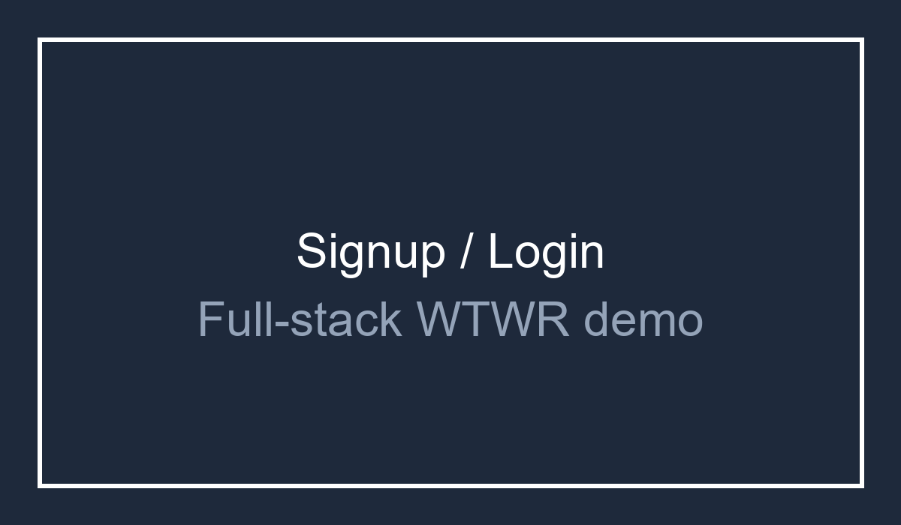
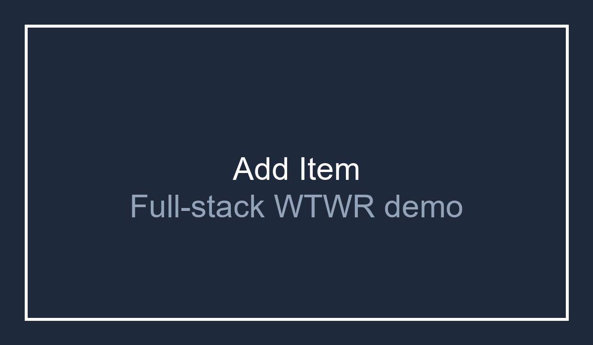
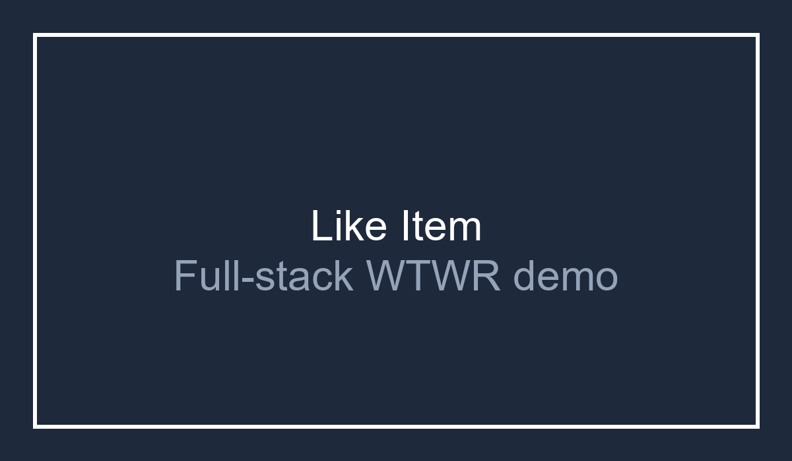
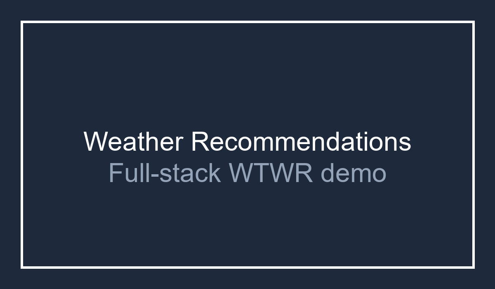

# 👗 WTWR — What to Wear?

A React-based full-stack web application that recommends clothing based on real-time local weather data and communicates with a deployed Express/MongoDB backend. Built as part of a full-stack software engineering curriculum, this project demonstrates React component architecture, API integration, JWT auth, protected routes, and responsive UI design.

🔗 **[Live Demo](https://WeatherGCPServer.jumpingcrab.com)**

---

## 📋 Table of Contents

- [Overview](#overview)
- [Backend](#backend)
- [Features](#features)
- [Tech Stack](#tech-stack)
- [Deployment](#deployment)
- [Demo](#demo)
- [Getting Started](#getting-started)
- [Project Structure](#project-structure)
- [Known Issues & Upcoming Fixes](#known-issues--upcoming-fixes)
- [Roadmap](#roadmap)

---

## Overview

WTWR fetches current weather data from the OpenWeatherMap API and filters a wardrobe of clothing items by weather type — **hot**, **warm**, or **cold** — to recommend what to wear today.

The app includes signed-in user flows, a protected profile page, modal forms for adding items, like/unlike interactions, and an F/C temperature toggle.

---

## Backend

This project is deployed as a full-stack application. The React frontend communicates with a live Express REST API backed by MongoDB and hosted on Google Cloud Platform.

- Live full-stack application: https://WeatherGCPServer.jumpingcrab.com
- Deployed backend API base: https://api.WeatherGCPServer.jumpingcrab.com
- Backend repository: https://github.com/Noa-GH/se_project_express

For local development, the project still supports a mock item API powered by `json-server`.

The deployed backend enables JWT authentication, profile editing, item creation, deletion, likes, and protected routes.

---

## Features

- 🌤️ **Live weather fetching** via OpenWeatherMap API
- 👔 **Weather-based clothing recommendations** filtered by hot / warm / cold
- 🌡️ **Celsius / Fahrenheit toggle** for temperature display
- 🪟 **Modal-driven item preview and add flow**
- 🔐 **User registration / login** with JWT auth and protected profile routes
- 🧑‍💼 **Profile editing** for name and avatar updates
- ❤️ **Like / unlike clothing items** for authenticated users
- 🗑️ **Item creation and deletion** with ownership checks and confirmations
- 🧪 **Form validation** with inline field state and disabled submit controls
- ⌨️ **Escape key and overlay click to close modals**

---

## Tech Stack

| Layer        | Technology                                           |
| ------------ | ---------------------------------------------------- |
| UI Framework | React 18                                             |
| Build Tool   | Vite 5                                               |
| Styling      | Plain CSS                                            |
| HTTP         | Fetch API (native browser)                           |
| Weather Data | [OpenWeatherMap API](https://openweathermap.org/api) |
| Backend API  | Express + MongoDB on GCP                             |
| Linting      | ESLint with React + React Hooks plugins              |
| Font         | Cabinet Grotesk (self-hosted WOFF)                   |
| Deployment   | Google Cloud Platform with custom production config  |

---

## Deployment

Deployed as a full-stack application using Google Cloud Platform for backend hosting and production environment configuration. The application uses a React frontend, Express REST API, MongoDB persistence, JWT authentication, and protected user actions.

---

## Demo

Below are screenshots showing the live full-stack experience for signup/login, adding items, liking items, and weather recommendations.









---

## Getting Started

### Prerequisites

- Node.js `>=18.0.0`
- npm `>=8.0.0`

### Installation

```bash
# Clone the repository
git clone https://github.com/Noa-GH/se_project_react.git

# Navigate into the project directory
cd se_project_react

# Install dependencies
npm install
```

### Run locally

```bash
# If json-server is not installed globally, install it first
npm install -g json-server

# Start the local item API server
npm run server

# In another terminal, start the frontend
npm run dev
```

The frontend launches on `http://localhost:3000` by default.

### Available Scripts

| Command           | Description                                      |
| ----------------- | ------------------------------------------------ |
| `npm run dev`     | Start the local dev server                       |
| `npm run build`   | Build for production                             |
| `npm run preview` | Preview the production build                     |
| `npm run lint`    | Run ESLint across the project                    |
| `npm run server`  | Start json-server for local `/items` API storage |

---

## Project Structure

```
src/
├── assets/              # Icons, fonts, and weather images
├── components/
│   ├── App/             # Root component, routing, app state
│   ├── Header/          # Header with weather, nav, login/profile
│   ├── Main/            # Weather card + filtered clothing list
│   ├── Footer/          # Footer with developer credit and year
│   ├── WeatherCard/     # Displays temperature and weather image
│   ├── ItemCard/        # Individual clothing card UI
│   ├── ItemModal/       # Selected item preview and delete action
│   ├── AddItemModal/    # Add-garment modal wrapper
│   ├── RegisterModal/   # Sign up modal
│   ├── LoginModal/      # Log in modal
│   ├── EditProfileModal/# Profile edit modal
│   ├── DeleteConfirmationModal/ # Confirm deletion modal
│   ├── SideBar/         # Profile sidebar actions
│   ├── ClothesSection/  # Authenticated user's item list
│   ├── ProtectedRoute/  # Route guard for authenticated pages
│   ├── ToggleSwitch/    # Temperature unit switch
│   └── ModalWithForm/   # Shared modal form with validation
└── utils/
    ├── api.js           # Weather and item CRUD API helpers
    ├── auth.js          # Register, login, token validation
    ├── constants.js     # Default coordinates and API key
    └── validation/      # Form validation schema and utilities
```

---

## Known Issues & Upcoming Fixes

### 🌥️ Weather Card Image Scaling

The weather card image may require additional responsive tuning in some viewport sizes.

---

## Roadmap

- [x] Fix weather card image responsiveness
- [x] Implement form input validation (name + URL fields)
- [x] Enable/disable submit button based on form validity
- [x] Add ability to delete clothing items
- [x] Add Celsius/Fahrenheit temperature toggle
- [x] Deploy full-stack backend and connect persistent auth/item storage
- [ ] Improve mobile-responsive layout further

---

## Author

**Noah Ford**
Built as part of the TripleTen Software Engineering program.
